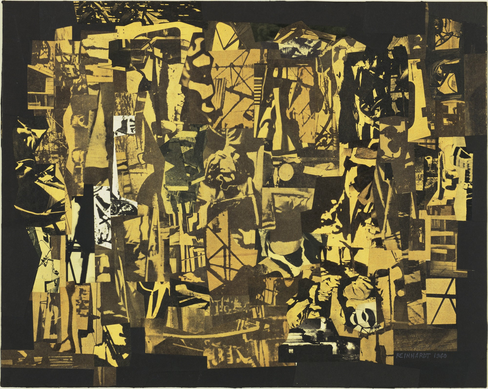

# E-SSENCE - An experiment to tackle abstract creation and the possible property of it

  

## Contents of this file

 - Introduction/ presentation
 - Requirements
 - Installation
 - Troubleshooting
 - Maintainers
 
## Introduction/Presentation

The intention behind this project is to experiment with State of the Art technologies and trying to link several fields, i.e AI, web development and blockchain technology.

Tackling art and image creation through a GAN model and training it on a dataset constructed with abstract paintings of various painters.

## Future

In the future, various paths could be taken, first to try to implement diffusion models instead of a GAN, and then maybe make a web interface to access it online.

## Requirements

This project requires python (version 3.12 was used but another version should be fine), jupyter notebook, and several extensions to run the code.

## Installation

- Create a virtual env \
 `python3 -m name /PATH`\
 `source name/bin/activate`\
(install the libraries here too, so tensorflow or tensorflow-gpu, tensorflow_addons, numpy, pandas, keras)\
- install jupyter notebook\
 `pip3 install jupyter`
- launch it and open the file generative_model_.ipynb\
 `jupyter notebook`

## Maintainers

Current maintainer:
<ul>
<li>Sinful King : https://github.com/SinfulKing</li></ul>

## Datasets used :

<ul> 
  <li>C. Gontier, J. Jordan, and M. A. Petrovici (2022). DELAUNAY: a dataset of abstract art for psychophysical and machine learning research. arXiv preprint.
(https://arxiv.org/abs/2201.12123)
 </li>

<li> Abstract Art Images, Kaggle : <ul>
                                     <li> (https://www.kaggle.com/datasets/greg115/abstract-art)</li>
                                     <li> (https://www.kaggle.com/datasets/bryanb/abstract-art-gallery)</li>
 </li>
 </ul>
